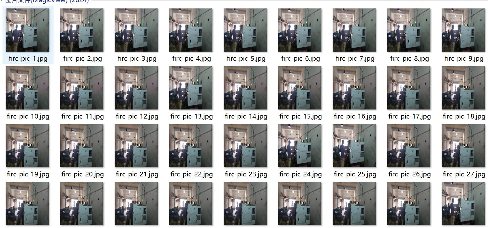
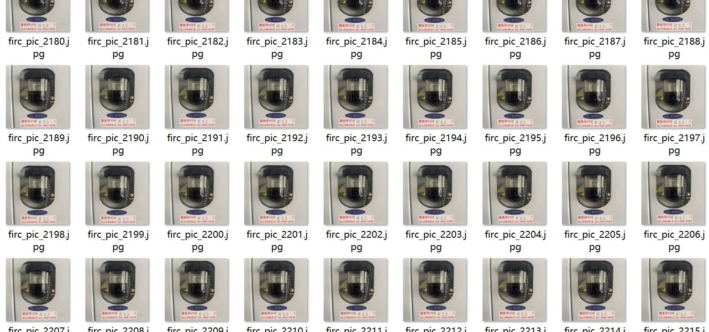
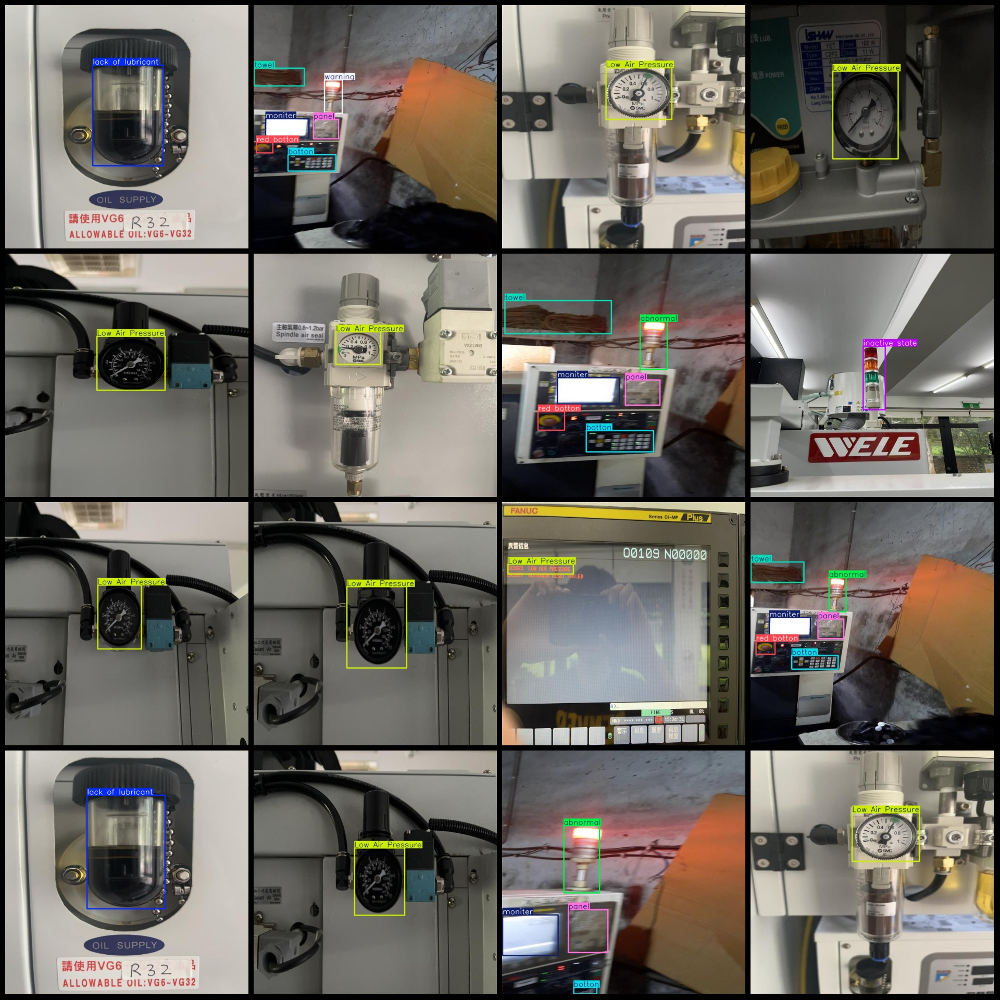
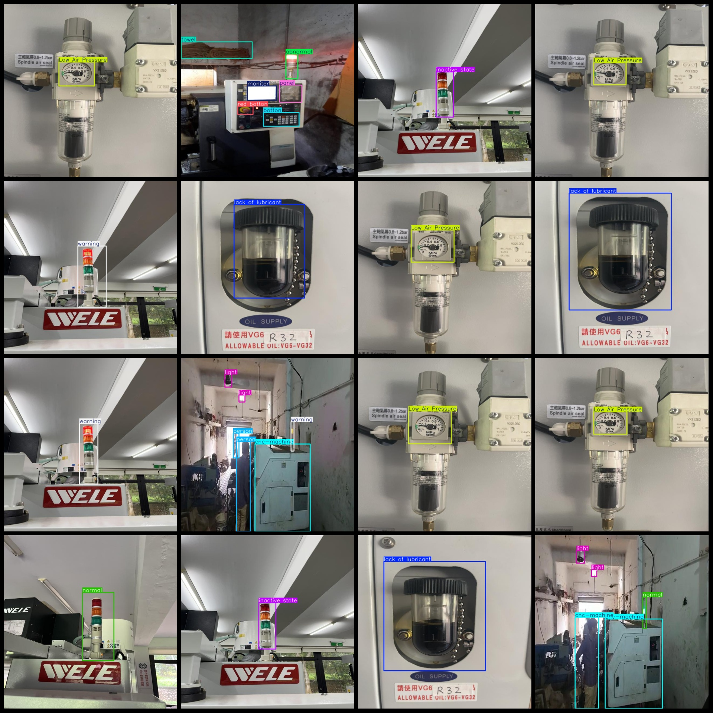

# CNC Machine Abnormality Detection Dataset VOC+YOLO Format with 2824 Images and 15 Categories

Dataset format: Pascal VOC format + YOLO format (txt file without split path, only contains jpg images and corresponding VOC format xml files and yolo format txt files)
Number of images (jpg file count): 2824
Number of annotations (xml file count): 2824
Number of annotations (txt file count): 2824
Number of annotation categories: 15
Annotation category names (note that the order of categories in the yolo format does not correspond to this, but is based on classes.txt in the labels folder): ["Autodoor Reset Failed", "Low Air Pressure", "abnormal", "botton", "cnc-machine", "inactive state", "lack of lubricant", "light", "monitor", "normal", "panel", "person", "red botton", "towel", "warning"]
Number of boxes for each category:
- Autodoor Reset Failed = 139
- Low Air Pressure = 1467
- abnormal = 320
- botton = 317
- cnc-machine = 214
- inactive state = 51
- lack of lubricant = 404
- light = 420
Monitor (Monitor/Display) Frames = 324
Normal (Normal) Frames = 248
Panel (Panel) Frames = 315
Person (Person) Frames = 290
Red Button (Red Button) Frames = 310
Towel (Towel/Mop) Frames = 261
Warning (Warning) Frames = 245
Total Frames: 5325
Each Category Occupies Pictures:
Autodoor Reset Failed (Automatic Door Reset Failed) Occupies Pictures = 139
Low Air Pressure (Air Pressure Low) Occupies Pictures = 1466
Abnormal (Anomaly) Occupies Pictures = 320
Button (Button) Occupies Pictures = 317
CNC-Machine (CNC Machine) Occupies Pictures = 211
Inactive State (Inactive State) Occupies Pictures = 51
The lack of lubricant (lack of lubricant) is a common issue in many mechanical systems. It can cause friction and wear, leading to decreased efficiency and potential failure. To address this issue, it's important to ensure that the appropriate amount of lubricant is used and that the system is properly maintained.
"Light" is a common English word, but it does not have a specific meaning in this context as the question doesn't specify what "light" refers to. If we assume that "light" means the number of photos associated with the term "light", then the answer would be:

```markdown
The number of photos associated with the term "light" is 210.
```
Monitor (monitor/display) occupancy = 324
Normal (normal) occupancy = 247
Panel (panel) occupancy = 315
Person occupies a picture count = 207
The red button occupies a picture count of 309.
"Towels (towels)" refers to a type of cloth used for drying oneself after bathing or cleaning. It is a common household item that is often found in bathrooms, kitchens, and living rooms. The number "261" could represent the amount of towels owned by someone or a specific household.
Warning: Ownership count = 245
Image resolution: 640x640
Use the labeling tool: LabelImg.
Annotation rules: draw a rectangle around the category.

This is a simple Python code example that uses the matplotlib library to draw rectangles around different categories in a dataset. The dataset is assumed to be a list of dictionaries, where each dictionary represents a data point and contains the values for different attributes.

```python
import matplotlib.pyplot as plt

# Assuming we have a dataset with categories and their respective values
data = [
    {'category': 'A', 'value': 10},
    {'category': 'B', 'value': 20},
    {'category': 'C', 'value': 30},
    {'category': 'D', 'value': 40},
    {'category': 'E', 'value': 50}
]

# Extract the category attribute from each data point
categories = [point['category'] for point in data]

# Plot the data points with rectangles around the categories
fig, ax = plt.subplots()
for i, category in enumerate(categories):
ax.plot([i, i], [0, 0], 'ro') # Red rectangle for the current category
ax.text(i, 0.5, category, ha='center', va='bottom') # Text label for the category

plt.show()
```

This code will create a bar plot with red rectangles around the categories 'A', 'B', 'C', 'D', and 'E'. Each bar represents a data point, and the rectangles indicate the category of that data point. The text labels on the x-axis provide additional information about the categories.
Important note: The dataset has not been split into training, validation, and test sets. Please do so yourself.
Special Disclaimer: This dataset does not guarantee the accuracy of the trained model or the weights file.
Preview of the image:
## Images






Here is a pay link on Stripe ( https://buy.stripe.com/3cs8yP7sY87d0vu9AB ). Please contact me lonlonago@foxmail.com after funding $89, and I will send you a complete data files , thank you!

